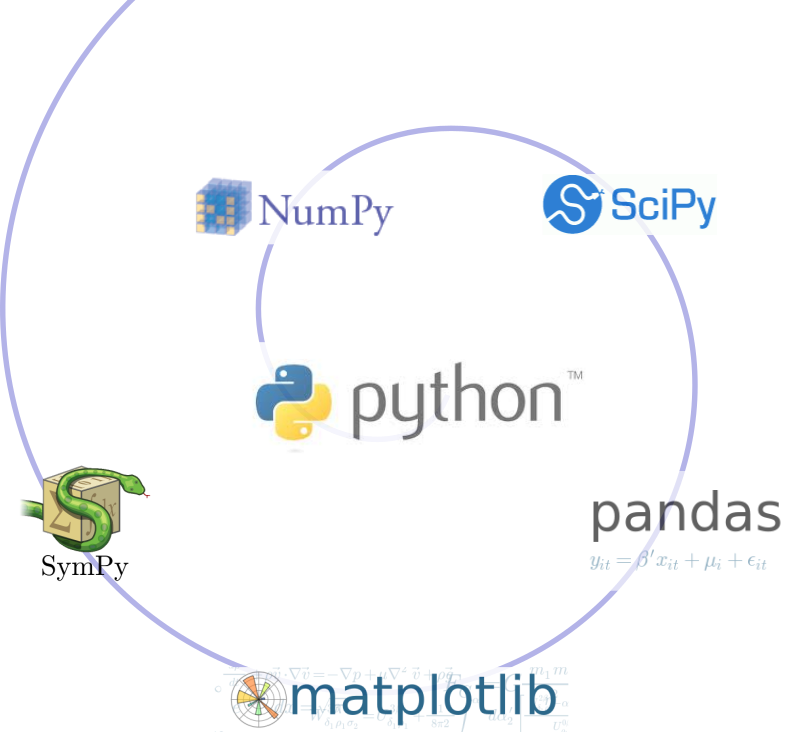

% Connecting ArcGIS with R and Conda
% Shaun Walbridge

<section data-background="images/title.jpg">
<h2>[https://github.com/scw/nyc-r-ws](https://github.com/scw/nyc-r-ws)</h2>
<h3>[High Quality PDF](https://4326.us/esri/nyc-r-ws/nyc-r-workshop-presentation-full.pdf)</h3>
</section>

ArcGIS {data-background="images/Picture2.jpg"}
================

Today: R and Conda {data-background="images/Picture2.jpg"}
-------------------

- Conda
    + Introduction
    + _Optional demo_
<br><br>
- R and the R-ArcGIS Bridge 
    + Introduction
    + Demo
    + Road Ahead

Software Ecosystem {data-background="images/Picture2.jpg"}
=========

Connecting with ArcGIS {data-background="images/Picture2.jpg"}
----------------

 - Don't have an equivalent API for accessing our services via _R_ like the ArcGIS API for Python (_yet_)
 - ArcGIS is a _system of record_. Combine data and analysis from many fields and into a common environemnt.
 - Why connect? Can't do it all, we support over 1000 GP tools &mdash; enabling _integration_ across environments for realistic workflows

<span style="display:none">.</span>{data-background="images/Picture2.jpg"}
-----------------

<span style="display:none">.</span> {class="tight" style="margin-top:-100px"}


The SciPy Stack {data-background="images/Picture2.jpg"}
----------------------------------

<span style="display:none">.</span> {class="tight" style="height: 600px"}

Data science {data-background="images/Picture2.jpg"}
------------

 - Python (SciPy stack, Jupyter, scikit-learn, ...)
 - C++ (Tensorflow, Shark, MLC++)
 - Java (Spark MLlib, Weka)
 - **R** ([ML task view](https://cran.r-project.org/web/views/MachineLearning.html))
 - Many workflows require combining components from multiple environments.

Packages with Conda {data-background="images/Picture2.jpg"}
===================

Why package management? {data-background="images/Picture2.jpg"}
----------------------------------

 - Software is composed of many smaller components, often called _packages_ or _libraries_.
 - It's often better to reuse code that solves a problem well rather than recreating it
 - But, sharing code is a **hard problem**. Do you have the same packages of the same versions 
   as the developer did?

Why Conda? {data-background="images/Picture2.jpg"}
----------

{style="width: 200px; background-color: rgba(255, 255, 255, 1);"}

* Scientific Python community identified that there was a gap not being addressed by the core Python infrastructure, limiting their ability to get packages into the hands of users

* Industry standard built by people who care about this space &mdash; _Continuum Analytics_ (Esri partner)

Why Conda? {data-background="images/Picture2.jpg"}
----------

{style="width: 200px; background-color: rgba(255, 255, 255, 1);"}

* It solves the hard problem:

    - Handles dependencies for many languages (C, C++, R and of course Python)
    - Built for Python first, but it really solves a much broader infrastructural issue.


Conda {data-background="images/Picture5.jpg"}
=====

<span style="display:none">.</span> {class="tight"} {data-background="images/Picture5.jpg"}
-----

 - Cross-platform: Simply develop recipes for building and installing software on Linux, OS X and Windows.
 - Open source: Esri is using it, you can use it in your own projects for other contexts

What can it install?  Not just scientific packages, can install everything from interactive environments like [Spyder](https://pythonhosted.org/spyder/) to [Jupyter Notebooks](https://jupyter.readthedocs.org/).

<span style="display:none">.</span> {class="tight"} {data-background="images/Picture5.jpg"}
--------------

 + _Environments_ &mdash; Can isolate an environment, flexibly make changes withot affecting installed software.
 + _Requirements_ &mdash; include explicit state information, not just the package name.
 + _Packages_ &mdash; an environment is built up from one or more packages, can be from _many_ languages &ndash; from R to C++ to Fortran.
 + Also handles platforms and Jupyter notebooks


Where do packages come from? {data-background="images/Picture5.jpg"}
----------------------------

Conda packages can come from a variety of locations:

 - **[anaconda.org](https://anaconda.org)** many thousands of packages
 - Repositories (e.g. Anaconda Cloud, self-hosted)
 - On disk

Conda Basics {data-background="images/Picture5.jpg"}
------------

    conda --help

    conda info

Conda info is the starting point &mdash; it tells you the state of the environment.

Conda Basics {data-background="images/Picture5.jpg"}
------------

    conda list

    # packages in environment at C:\ArcGIS\bin\Python\envs\arcgispro-py3:
    #
    colorama                  0.3.7                    py35_0    defaults
    cycler                    0.10.0                   py35_0    defaults
    future                    0.15.2                   py35_0    defaults
    matplotlib                1.5.3              np111py35_0e  [arcgispro]  esri
    mpmath                    0.19                     py35_1    defaults
    netcdf4                   1.2.4                   py35_0e  [arcgispro]  esri
    nose                      1.3.7                    py35_1    defaults
    numexpr                   2.6.1              np111py35_0e  [arcgispro]  esri
    numpy                     1.11.2                  py35_0e  [arcgispro]  esri
    pandas                    0.19.0              np111py35_0    defaults
    pip                       8.1.2                    py35_0    defaults
    py                        1.4.31                   py35_0    defaults
    pyparsing                 2.1.4                    py35_0    defaults
    pypdf2                    1.26.0                     py_0    esri
    pytest                    2.9.2                    py35_0    defaults
    python                    3.5.2                         0    defaults
    python-dateutil           2.5.3                    py35_0    defaults
    pytz                      2016.6.1                 py35_0    defaults
    requests                  2.11.1                   py35_0    defaults
    scipy                     0.18.1             np111py35_0e  [arcgispro]  esri
    setuptools                27.2.0                   py35_1    defaults
    sympy                     1.0                      py35_0    defaults
    wheel                     0.29.0                   py35_0    defaults
    xlrd                      1.0.0                    py35_0    defaults
    xlwt                      1.1.2                    py35_0    defaults


Conda Basics {data-background="images/Picture5.jpg"}
------------

Activating environments, a couple ways:

 * Use the shortcuts
 * Manually activate the environment:

```sh
    cd C:\ArcGIS\bin\Python\Scripts
    activate arcgispro-py3
```

Conda Basics {data-background="images/Picture5.jpg"}
------------

* A collection of packages and Python install is called an *environment* or *env*, the building block for managing Python with Conda
* Can have multiple environments and seamlessly switch between them


Conda vs... {data-background="images/Picture5.jpg"}
-----------

Name | Means | Included?
-|-|-
Conda | The command itself | ✓
Miniconda | A minimum set of Python packages to build and run Conda. | ✓
Anaconda | A distribution 200+ packages built with Conda | &nbsp;
Anaconda Server | Host the full infrastructure internally | &nbsp;


Deeper Dive {data-background="images/Picture5.jpg"}
===========

How can I use this? {data-background="images/Picture5.jpg"}
-------------------

* ArcGIS (Desktop & Server) ships the SciPy stack &mdash; powerful and out of the box in all products
* Conda command and a Conda root Python install
* New modules (e.g. ``requests``), environment with Pro

. . .

* Get packages, expand your possibility space
* Package your work: this is an opportunity to distribute it, possibly including commercial side as well.

How can I use this? {data-background="images/Picture5.jpg"}
-------------------

<span style="display:none">.</span> {class="tight"}


R {data-background="images/Picture4.jpg"}
=


Esri and {class="tight" style="width: 96px"}? {data-background="images/Picture4.jpg"}
------

 - Integration via ArcGIS&ndash;R bridge
 - Joined [R Consortium](https://www.r-consortium.org/) and [R Foundation](https://www.r-project.org/foundation)
 - More to come &mdash; GIS has historically been more coupled with Python

Why {class="tight" style="width: 96px"}? {data-background="images/Picture4.jpg"}
------

 - Powerful core data structures and operations
    + Data frames, functional programming
 - Unparalleled breadth of statistical routines
    + The _de facto_ language of Statisticians
 - `CRAN`: 6400 packages for solving problems
 - Versatile and powerful plotting

R Data Types {data-background="images/Picture4.jpg"}
------------

[Data types](https://en.wikipedia.org/wiki/Data_type) you're used to seeing...

`Numeric` - `Integer` - `Character` - `Logical` - `timestamp`

. . .

... but others you probably aren't:

`vector` - `matrix` - `data.frame` - `factor`

Data Frames {data-background="images/Picture4.jpg"}
-----------

 - Treats tabular (and multi-dimensional) data as a _labeled_, _indexed_ series of observations. Sounds simple, but is a game changer over typical software which is just doing 2D layout (e.g. Excel)

Data Types {data-background="images/Picture4.jpg"}
----------

```r
# Create a data frame out of an existing source
df.from.csv <- read.csv(
    "data/growth.csv",
    header=TRUE)
```

Data Types {data-background="images/Picture4.jpg"}
----------

```r
# Create a data frame from scratch
quarter <- c(2, 3, 1)
person <- c("Goodchild", 
            "Tobler", 
            "Krige")

met.quota <- c(TRUE, FALSE, TRUE)
df <- data.frame(person,
                 met.quota,
                 quarter)
```
Data Types {data-background="images/Picture4.jpg"}
----------

```r
R> df
     person met.quota quarter
1 Goodchild      TRUE       2
2    Tobler     FALSE       3
3     Krige      TRUE       1
```
<div class="notes">
Many packages define their own objects, conversion is an important step in any analysis dealing with higher order objects beyond simple data frames.
</div>

``sp`` Types {data-background="images/Picture4.jpg"}
------------

<div style="float: left; width: 50%;">
  - 0D: ``SpatialPoints``
  - 1D: ``SpatialLines``
  - 2D: ``SpatialPolygons``
  - 3D: Solid
  - 4D: Space-time
</div>

Entity + Attribute model

<div class="notes">
Spatial types class for R. Solids and space time are both 'in development', nothing directly in ``sp`` but folks are working on this.

Also a `raster` package, but not covering this today.
</div>

Statistical Formulas {data-background="images/Picture4.jpg"}
--------------------

```r
fit.results <- lm(pollution ~ elevation + rainfall + ppm.nox + urban.density)
```

 - Domain specific language for statistics
 - Similar properties in other parts of the language
 - [``caret``](https://cran.r-project.org/web/packages/caret/vignettes/caret.pdf) for model specification consistency

R &mdash; ArcGIS Bridge {data-background="images/intro-bg.jpg"}
-----------------------

<div class="notes">
Delicate Arch at Night: https://commons.wikimedia.org/wiki/File:Delicate_Arch_at_Night_%288708111489%29.jpg
</div>

R &mdash; ArcGIS Bridge {data-background="images/Picture4.jpg"}
-----------------

<span style="display:none">.</span> {class="tight"}


R &mdash; ArcGIS Bridge {data-background="images/Picture4.jpg"}
---------------

{style="border: none"}

 - ArcGIS developers can _create tools and toolboxes_ that integrate ArcGIS and R
 - ArcGIS users can _access R_ code through geoprocessing scripts
 - R users can _access organizations GIS' data_, managed in traditional GIS ways

[https://r-arcgis.github.io](https://r-arcgis.github.io/)

R &mdash; ArcGIS Bridge {data-background="images/Picture4.jpg"}
---------------

Store your data in ArcGIS, access it quickly in R, return R objects back to ArcGIS native data types (e.g. geodatabase feature classes).

Knows how to convert spatial data to ``sp`` objects.

[Package Documentation](https://r-arcgis.github.io/assets/arcgisbinding.pdf)

Access ArcGIS from R {data-background="images/Picture4.jpg"}
------------------------

Start by loading the library, and initializing connection to ArcGIS:

```r
# load the ArcGIS-R bridge library
library(arcgisbinding)
# initialize the connection to ArcGIS. Only needed when running directly from R.
arc.check_product()
```
Access ArcGIS from R {data-background="images/Picture4.jpg"}
------------------------

First, select a data source (can be a feature class, a layer, or a table):
```r
input.fc <- arc.open('data.gdb/features')
```
Then, filter the data to the set you want to work with (creates in-memory data frame):
```r
filtered.df <- arc.select(input.fc,
                          fields=c('fid', 'mean'),
                          where_clause="mean < 100")
```

This creates an _ArcGIS data frame_ -- looks like a data frame, but retains references back to the geometry data.

Access ArcGIS from R {data-background="images/Picture4.jpg"}
------------------------

Finished with our work in R, want to get the data back to ArcGIS. Write our results back to a new feature class, with ``arc.write``:

```r
arc.write('data.gdb/new_features', results.df)
```

Building R Script Tools {data-background="images/Picture4.jpg"}
-----------------------

{class="tight" style="height:32px"}

{style="height:500px;"}

R ArcGIS Bridge Demo {data-background="images/Picture4.jpg"}
--------------------

* Details of model based clustering analysis in the [R Sample Tools](https://github.com/R-ArcGIS/r-sample-tools)

How To Install {data-background="images/Picture4.jpg"}
--------------

* Install with the [R bridge install](https://github.com/R-ArcGIS/r-bridge-install)
* [Detailed installation instructions](https://github.com/R-ArcGIS/r-bridge-install#installation)

Where Can I Run This? {data-background="images/Picture4.jpg"}
---------------------


Road Ahead {data-background="images/Picture4.jpg"}
==========


Road Ahead: next few months {data-background="images/Picture4.jpg"}
------------

 - Raster
 - [Microsoft R server](https://www.microsoft.com/en-us/cloud-platform/r-server)
 - Data Science VM on Azure &mdash; data science problem solving with R, Python, ArcGIS and much more

Road Ahead: longer term {data-background="images/Picture4.jpg"}
------------

 - Geoprocessing from R &mdash; stay in R for everything
 - ArcGIS API for R
